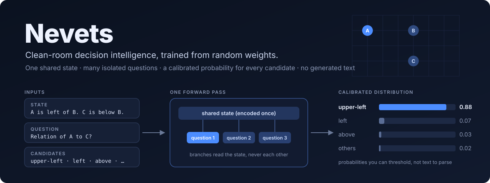

# SystemOne Lab — clean-room decision model from random weights

<p align="center"></p>

<p align="center"><strong>▶ Live demos, running entirely in your browser:</strong>
<a href="https://stevenmcsorley.github.io/Nevets/general.html">General playground</a> ·
<a href="https://stevenmcsorley.github.io/Nevets/treasure.html">Treasure Hunt</a> ·
<a href="https://stevenmcsorley.github.io/Nevets/chess.html">Chess</a> ·
<a href="https://stevenmcsorley.github.io/Nevets/">all demos</a></p>

This repository is a **from-scratch** research lab for a small, prefill-only, calibrated decision model inspired by the public System One contract: one shared `state`, isolated typed questions, direct probability distributions, and no autoregressive answer generation.

It does **not** use Jev outputs as labels, does not query Jev for reverse-engineering, and does not contain Jev weights or proprietary data. The architecture is derived from public documentation, ordinary transformer techniques, and independently published open research.

**Data attribution.** Nevets language pretraining uses **FineWeb-Edu** (Hugging Face, `HuggingFaceFW/fineweb-edu`), licensed under the **Open Data Commons Attribution License (ODC-By) v1.0**; FineWeb-Edu is derived from Common Crawl, whose terms of use also apply. This covers the legacy LM (`s1-35m-pretrain.pt`, from which every released decision model descends) and the new PT lineage (revision `87f09149ef4734204d70ed1d046ddc9ca3f2b8f9`). Chess positions come from the Lichess open database (CC0). Source-by-source details are in `DATA_SOURCES.md`.

## What is and isn't in this repository (Nevets)

The code, configs, tests, evaluation suites and research records (`reports/FRONTIER_STATE.md`, `reports/RESEARCH_LEDGER.md`, `reports/CHECKPOINT_REGISTRY.md`) are in git. The following are deliberately excluded (see `.gitignore`):

- **Checkpoints** (`checkpoints/`, about 130 MB each). The registry records each checkpoint's lineage and the exact training command.
- **Datasets** (`data/`) and **generated training splits** under `reports/**/train*.jsonl`. Every generator is seeded, and the seeds are recorded in the ledger and the reproduce commands.
- **Lichess dumps.** Download `lichess_db_standard_rated_2013-01/02.pgn.zst` from https://database.lichess.org/ (CC0). Their SHA-256 values are in `reports/FRONTIER_STATE.md`.
- **Demo models** for the in-browser demos (`site/`) are int8 ONNX exports published as the [`demo-models-v3`](https://github.com/stevenmcsorley/Nevets/releases/tag/demo-models-v3) release. The Pages workflow downloads them and checks them against `site/model/SHA256SUMS`.
- **Stockfish** (GPL-3). Download the official build from https://github.com/official-stockfish/Stockfish/releases and unpack it under `tools/stockfish/`.

## Current status: usable one-hop decision model, not promotable (25 September 2026)

**Candidate:** `checkpoints/exp9-aux-loop.pt` (config `configs/s1_35m_entity_binding_aux_loop.yaml`). It is reliable for **one-hop spatial questions, including states with distractor facts, and short (1–2-hop) chains**. It does **not** pass the 70M promotion gates: multi-hop composition beyond about two hops is unsolved. Keep `checkpoints/paired-paraphrase-onehop-gate.pt` as the untouched reference.

**Locked results** (evaluated once, after candidate selection; full numbers in `reports/locked_final/summary.json`):

| Locked set | Candidate | Reference | Gate |
|---|---|---|---|
| Stress: one-hop with distractors and simple two-hop (1,432) | **100%** | 19.0% | — |
| One-hop role swap / name pairs / counterfactual / held-out (dev gates) | **100% / 100% / 100% / 100%**, ECE15 0.004 | 7.8% / 88.5% / 86% / 52.3% | ≥ 98% ✓ |
| Chains with branch and disconnected distractors: 1 / 2 / 3 hops | 96.6% / 81.4% / 57.1% | 20.5% / 6.4% / 15.9% | — |
| Chains, unseen 7–10 hops | 26–38% (majority label 17–22%) | 13–19% | ≥ 90% ✗ |
| Rotation/reflection consistency (1–3 hops) | 85.4% | 27.0% | ≥ 95% ✗ |
| Original `data/processed/spatial_locked.jsonl` (10,000) | 38.4% | 19.4% | ≥ 97% ✗ |
| Locked counterfactual, 3–10 hops (3,000 pairs): both correct / correct shift | 14.8% / 51.4% | 4.1% / 31.6% | ≥ 90% / ≥ 97% ✗ |
| ECE15: stress / chains / `spatial_locked` | 0.072 / 0.104 / 0.118 | 0.56 / 0.48 / 0.39 | ≤ 0.05 ✗ |

Translation invariance holds by construction for these text worlds: every fact is relative, so translating a world does not change its text.

**How to use it.** Treat answers with confidence ≥ 0.9 as reliable, and anything lower as uncertain. At that threshold, locked accuracy was 100% on the stress set (76% coverage), 98.4% on transforms (42%), and 95.1% on chains (14%). One-hop chain questions reach 98.4% at 70% coverage. On the original `spatial_locked` distribution the threshold gives only 82.8% accuracy at 4% coverage, so do not rely on it there. A global temperature fit on a separate dev set (`scripts/calibrate_temperature.py`, `reports/calibration/exp9_temperature.json`) lowered NLL but raised ECE, so it was not applied. The miscalibration is overconfidence in the 0.3–0.7 band, which one temperature cannot fix.

**What changed, in order** (each step checked against every locked development gate with `scripts/run_gates.py`; per-experiment results are in `reports/loop/`):
1. **`entity_binding` query mode.** A zero-initialized projection of the difference between the query names' contextual state occurrences. Reversing the query order exactly negates it. This fixed role swaps (7.8% → 90%). See the entity-binding section below.
2. **Multi-fact curriculum.** Every earlier decision set used one-sentence states, and accuracy collapsed on any multi-fact state. `scripts/generate_binding_stress.py` and `scripts/generate_chain_curriculum.py` build distractor and chain worlds, filtered against every evaluation state.
3. **Backbone learning rate 3e-6 → 3e-5.** This was the largest single optimization gain, with no one-hop regressions.
4. **`state_attention: bidirectional`.** The state is never generated, so state tokens attend to the whole state; question branches stay isolated and causal. Under identical training, stress accuracy rose 83.9% → 93.2%.
5. **Longer training, a 1–4-hop curriculum, `aux_coord_weight`, and a gated weight-tied loop (`loop_iters`, `loop_blocks`).** The auxiliary loss is a training-only regression of each object's coordinates from its mentions. The loop gates are zero-initialized, so enabling the loop leaves outputs unchanged. Together these raised 1–4-hop chain accuracy. The loop alone (exp6b, exp7) and the auxiliary loss alone (exp8) were each within noise.

**Why multi-hop stalls.** Per-axis accuracy falls with hop count, and labels that need steps to cancel (e.g. `left`, which needs a net vertical offset of zero) fall to 9% by six hops. The model is not summing displacements along the chain. A probe of the auxiliary coordinate head recovers exact positions for 37% of objects one link from the reference, 27% at two links, and 6% at three. The next research step is a mechanism that composes offsets explicitly (for example, iterative message passing between entity mentions with per-step supervision), tested on the fixed chain suites before any longer run. Do not start a long corpus run or move to 70M from this candidate.

**Reproduce the candidate** (each step initializes from the previous checkpoint; data files are built by the listed generators with the seeds recorded in each file's `meta`, then shuffled with the one-hop retention set `reports/binding_stress/train_mixed.jsonl`):

```powershell
$py = ".\.venv\Scripts\python.exe"
# exp1: backbone lr 3e-5 on the multi-fact mix, from checkpoints/entity-binding-multifact-full.pt
& $py scripts/train_decision.py --config configs/s1_35m_entity_binding_bb3e5.yaml --init checkpoints/entity-binding-multifact-full.pt --tokenizer data/tokenizer.json --data reports/binding_stress/train_mixed.jsonl --batch 16 --steps 1200 --balanced-sampling --diagnostics --out checkpoints/exp1-bb3e5.pt
# exp4: bidirectional state, 1-6-hop chains (generate_chain_curriculum.py --seed 61001) + retention mix
& $py scripts/train_decision.py --config configs/s1_35m_entity_binding_bidir.yaml --init checkpoints/exp1-bb3e5.pt --tokenizer data/tokenizer.json --data reports/chain/train_exp2.jsonl --batch 16 --steps 3000 --balanced-sampling --diagnostics --out checkpoints/exp4-bidir.pt
# exp5: 15,000 steps on 30,000 fresh 1-6-hop worlds (seed 61003) + retention mix
& $py scripts/train_decision.py --config configs/s1_35m_entity_binding_bidir.yaml --init checkpoints/exp4-bidir.pt --tokenizer data/tokenizer.json --data reports/chain/train_exp5.jsonl --batch 16 --steps 15000 --balanced-sampling --diagnostics --out checkpoints/exp5-bidir-long.pt
# exp8 then exp9: 1-4-hop worlds with aux_coords (seed 61004) + retention mix
& $py scripts/train_decision.py --config configs/s1_35m_entity_binding_aux.yaml --init checkpoints/exp5-bidir-long.pt --tokenizer data/tokenizer.json --data reports/chain/train_exp8.jsonl --batch 16 --steps 6000 --balanced-sampling --diagnostics --out checkpoints/exp8-aux.pt
& $py scripts/train_decision.py --config configs/s1_35m_entity_binding_aux_loop.yaml --init checkpoints/exp8-aux.pt --tokenizer data/tokenizer.json --data reports/chain/train_exp8.jsonl --batch 16 --steps 8000 --balanced-sampling --diagnostics --out checkpoints/exp9-aux-loop.pt
# all development gates, including rotation/reflection
& $py scripts/run_gates.py --ckpt checkpoints/exp9-aux-loop.pt --out reports/loop/exp9.json --stress stress=reports/binding_stress/stress.jsonl --stress hops=reports/chain/eval_hops.jsonl --transforms reports/chain/transforms.jsonl
```

Serve it with `$env:S1_CHECKPOINT="checkpoints/exp9-aux-loop.pt"` (section 6). The API applies the checkpoint's bidirectional state mask and binding head automatically.

## Earlier status: paired one-hop gate (September 2026)

The 50,000-step language checkpoint is complete and protected at `checkpoints/s1-35m-pretrain.pt`. The 10,000-step cosine decision checkpoint at `checkpoints/s1-35m-spatial-v2.pt` is numerically stable, but it **fails the reasoning gates**: 38.64% on the original spatial dev set, 26% on a balanced held-out set, and both answers correct on only 2/100 counterfactual pairs. On matched worlds that differ only in object names, accuracy fell from 72% with `obj_#` names to 25.5% with letter names. The old `checkpoints/s1-35m-spatial.pt` has divergent pointer weights and must not be used as a starting point. See `reports/decision_failure_v2.md` for the investigation and `reports/spatial_v2_name_shift.json` for the paired name evidence.

The latest completed test trained *both name renderings of each identical one-hop world* under the same label. It used 800 training pairs (1,600 records), 200 disjoint held-out name pairs, and 100 held-out counterfactual pairs. All nine classes were approximately balanced. These commands reproduce that 600-step diagnostic from the repository root in PowerShell; they overwrite only the diagnostic files named here:

```powershell
.\.venv\Scripts\python.exe scripts/generate_paired_onehop.py --out-dir reports/paired_onehop --train-pairs 800 --heldout-pairs 200 --counterfactual-pairs 100 --seed 19091
.\.venv\Scripts\python.exe scripts/train_decision.py --config configs/s1_35m_decision_validated.yaml --init checkpoints/s1-35m-pretrain.pt --allow-tokenizer-mismatch --tokenizer data/tokenizer.json --data reports/paired_onehop/train.jsonl --batch 16 --steps 600 --diagnostics --out checkpoints/paired-onehop-gate.pt
.\.venv\Scripts\python.exe scripts/eval_name_pairs.py --ckpt checkpoints/paired-onehop-gate.pt --pairs reports/paired_onehop/name_pairs.json --out reports/paired_onehop/name_results.json
.\.venv\Scripts\python.exe scripts/eval_spatial.py --ckpt checkpoints/paired-onehop-gate.pt --data reports/paired_onehop/heldout.jsonl | Tee-Object -FilePath reports/paired_onehop/heldout_metrics.json
.\.venv\Scripts\python.exe scripts/eval_counterfactual.py --ckpt checkpoints/paired-onehop-gate.pt --data reports/paired_onehop/counterfactual.jsonl | Tee-Object -FilePath reports/paired_onehop/counterfactual_metrics.json
```

**Observed result:** 88% accuracy on 400 held-out renderings; ECE15 0.0678; Brier 0.1187. On the 200 matched name pairs, numbered accuracy was 89%, renamed accuracy 87%, both correct 82%, and predictions changed on 12%. On 100 held-out one-hop counterfactual pairs, both answers were correct 82% and the probability shift metric was 100%. Across the 600 steps, logged max |logit| was 8.67, no nonfinite values occurred, and sampled average loss fell from 2.09 (first 100 steps) to 0.21 (last 100). The original LM checkpoint remained unchanged.

This is strong one-hop progress, but it does **not** meet the promotion gates below (97% accuracy, 98% renaming consistency, 90% counterfactual both correct). The remaining errors cluster in `above` and `below`, especially inverse wording such as “B is below A” for an `above` answer. For a read-only breakdown, run:

```powershell
.\.venv\Scripts\python.exe scripts/analyze_onehop_errors.py --pairs reports/paired_onehop/name_pairs.json --results reports/paired_onehop/name_results.json --out reports/paired_onehop/template_errors.json
```

A larger read-only vertical probe now confirms the gap: 300 new matched pairs (50 per `above`/`below` wording template) yielded 58.7% numbered accuracy, 55.7% renamed accuracy, only 34% both correct, and 46.3% changed predictions. For the reversed `below` wording “B is above A,” accuracy was just 6% numbered and 26% renamed. The original 88% aggregate one-hop result masked this failure. Reproduce that probe with:

```powershell
.\.venv\Scripts\python.exe scripts/generate_vertical_probe.py --out reports/paired_onehop/vertical_probe_pairs.json --per-template 50 --seed 19123
.\.venv\Scripts\python.exe scripts/eval_name_pairs.py --ckpt checkpoints/paired-onehop-gate.pt --pairs reports/paired_onehop/vertical_probe_pairs.json --out reports/paired_onehop/vertical_probe_results.json
.\.venv\Scripts\python.exe scripts/analyze_onehop_errors.py --pairs reports/paired_onehop/vertical_probe_pairs.json --results reports/paired_onehop/vertical_probe_results.json --out reports/paired_onehop/vertical_template_errors.json
```

The completed 800-step paraphrase experiment paired **all available wordings of each same one-hop world** with both name styles. It contains 800 training worlds (3,734 rendered records) and 200 disjoint held-out worlds (934 renderings). The earlier vertical probe and 100 counterfactual pairs remain separate from training. The trainer uses class-balanced sampling because labels have different numbers of wording templates. To reproduce the completed experiment from the repository root in PowerShell:

```powershell
.\.venv\Scripts\python.exe scripts/generate_paired_paraphrase_onehop.py --out-dir reports/paraphrase_onehop --train-worlds 800 --heldout-worlds 200 --seed 20091
.\.venv\Scripts\python.exe scripts/train_decision.py --config configs/s1_35m_decision_validated.yaml --init checkpoints/s1-35m-pretrain.pt --allow-tokenizer-mismatch --tokenizer data/tokenizer.json --data reports/paraphrase_onehop/train.jsonl --batch 16 --steps 800 --balanced-sampling --diagnostics --out checkpoints/paired-paraphrase-onehop-gate.pt
.\.venv\Scripts\python.exe scripts/eval_name_pairs.py --ckpt checkpoints/paired-paraphrase-onehop-gate.pt --pairs reports/paraphrase_onehop/name_pairs.json --out reports/paraphrase_onehop/name_results.json
.\.venv\Scripts\python.exe scripts/eval_spatial.py --ckpt checkpoints/paired-paraphrase-onehop-gate.pt --data reports/paraphrase_onehop/heldout.jsonl | Tee-Object -FilePath reports/paraphrase_onehop/heldout_metrics.json
.\.venv\Scripts\python.exe scripts/eval_name_pairs.py --ckpt checkpoints/paired-paraphrase-onehop-gate.pt --pairs reports/paired_onehop/vertical_probe_pairs.json --out reports/paraphrase_onehop/vertical_probe_results.json
.\.venv\Scripts\python.exe scripts/analyze_onehop_errors.py --pairs reports/paired_onehop/vertical_probe_pairs.json --results reports/paraphrase_onehop/vertical_probe_results.json --out reports/paraphrase_onehop/vertical_template_errors.json
.\.venv\Scripts\python.exe scripts/eval_counterfactual.py --ckpt checkpoints/paired-paraphrase-onehop-gate.pt --data reports/paired_onehop/counterfactual.jsonl | Tee-Object -FilePath reports/paraphrase_onehop/counterfactual_metrics.json
```

**Observed result:** 88.87% accuracy and ECE15 0.0289 on 934 held-out renderings. On the *same* 200 name pairs used for the previous checkpoint, both-correct rose from 82% to 88.5% and prediction changes fell from 12% to 8%. On the same 300-pair vertical probe, both-correct rose from 34% to 45.7%. On the same 100 counterfactual pairs, both-correct rose from 82% to 86%. The 800-step run had no nonfinite values and max |logit| 8.85. The models differ in both curriculum and step count, so the improvement is diagnostic rather than a controlled single-variable estimate.

A further **role-swap gate** keeps the vertical fact unchanged and reverses the queried object order. The label must flip (`above` ↔ `below`). The paraphrase checkpoint got both orientations correct on only **7.8% of 600 tests** (previous one-hop checkpoint: 6.5%). Reproduce the read-only check with:

```powershell
.\.venv\Scripts\python.exe scripts/eval_role_swap.py --ckpt checkpoints/paired-paraphrase-onehop-gate.pt --pairs reports/paired_onehop/vertical_probe_pairs.json --out reports/paraphrase_onehop/vertical_role_swap.json
```

The completed role-swap diagnostic added **both question orientations** to each fact, with inverse labels where appropriate. It preserves both name styles and all wording variants, then filters complete four-rendering groups that collide with held-out or earlier vertical/counterfactual prompts. The prepared data contains 6,996 training records and 1,844 held-out records. It continued from the verified paraphrase checkpoint for 1,200 updates. These commands reproduce the experiment from the repository root in PowerShell:

```powershell
.\.venv\Scripts\python.exe scripts/prepare_role_swap_curriculum.py --source-dir reports/paraphrase_onehop --out-dir reports/role_swap_onehop
.\.venv\Scripts\python.exe scripts/train_decision.py --config configs/s1_35m_decision_validated.yaml --init checkpoints/paired-paraphrase-onehop-gate.pt --tokenizer data/tokenizer.json --data reports/role_swap_onehop/train.jsonl --batch 16 --steps 1200 --balanced-sampling --diagnostics --out checkpoints/role-swap-onehop-gate.pt
.\.venv\Scripts\python.exe scripts/eval_role_swap.py --ckpt checkpoints/role-swap-onehop-gate.pt --pairs reports/paired_onehop/vertical_probe_pairs.json --out reports/role_swap_onehop/vertical_role_swap.json
.\.venv\Scripts\python.exe scripts/eval_role_swap.py --ckpt checkpoints/role-swap-onehop-gate.pt --pairs reports/role_swap_onehop/name_pairs.json --out reports/role_swap_onehop/heldout_role_swap.json
.\.venv\Scripts\python.exe scripts/eval_name_pairs.py --ckpt checkpoints/role-swap-onehop-gate.pt --pairs reports/paired_onehop/name_pairs.json --out reports/role_swap_onehop/old_name_pairs.json
.\.venv\Scripts\python.exe scripts/eval_name_pairs.py --ckpt checkpoints/role-swap-onehop-gate.pt --pairs reports/paired_onehop/vertical_probe_pairs.json --out reports/role_swap_onehop/vertical_name_pairs.json
.\.venv\Scripts\python.exe scripts/analyze_onehop_errors.py --pairs reports/paired_onehop/vertical_probe_pairs.json --results reports/role_swap_onehop/vertical_name_pairs.json --out reports/role_swap_onehop/vertical_template_errors.json
.\.venv\Scripts\python.exe scripts/eval_spatial.py --ckpt checkpoints/role-swap-onehop-gate.pt --data reports/role_swap_onehop/heldout.jsonl | Tee-Object -FilePath reports/role_swap_onehop/heldout_metrics.json
.\.venv\Scripts\python.exe scripts/eval_counterfactual.py --ckpt checkpoints/role-swap-onehop-gate.pt --data reports/paired_onehop/counterfactual.jsonl | Tee-Object -FilePath reports/role_swap_onehop/counterfactual_metrics.json
```

**Outcome: failed reasoning gate.** The 1,200-step run was numerically stable (max |logit| 9.46, no nonfinite values), but vertical role-swap both-correct fell from **7.8% to 1.2%** on the same 600 cases. On the old 200 name pairs, both-correct fell 88.5% → 49.5%; on the same 100 counterfactual pairs, 86% → 30%. New held-out accuracy was 52.4%. Forward and swapped questions now receive the *same prediction* 97.8% of the time. A 20-example representation check found mean decision-state cosine similarity 0.9995 across role swaps. The model has not learned which named object the question asks about. Preserve the earlier `checkpoints/paired-paraphrase-onehop-gate.pt` as the better one-hop checkpoint. The role-swap checkpoint is a failed diagnostic, not a promoted model.

Further corpus training is not the next step. Inspect how the decision representation encodes the queried object order, then test a small architectural or input-format change on fixed paired role swaps before another long run. Raw comparisons are in `reports/role_swap_onehop/comparison.json` and `sensitivity.json`.

Two bounded query-order interventions have now been tested. `role_aware` adds the ordered difference of the two query-name embeddings to the pointer query and trains the whole model for 1,200 steps. It raises vertical role-swap both-correct to **46.2%**, but old name-pair both-correct falls to **33%**, counterfactual both-correct to **27%**, and new held-out accuracy to **50.2%**. A separate `role_adapter` projection trained for 1,200 steps with the backbone and original pointer head frozen preserves more old behavior (old name-pair both-correct **87.5%**, counterfactual both-correct **85%**), but reaches only **18.7%** vertical role-swap both-correct and **51.7%** new held-out accuracy. Its held-out role-swap both-correct is **10.2%**. Neither checkpoint passes the reasoning gate. The API now passes parsed query-entity order to these experimental scorers, matching the evaluation path.

The read-only scale sweep in `reports/role_swap_onehop/query_scale_sweep.json` shows that the role signal reaches the scorer, but stronger weighting trades away the previous task: on a small fixed subset, the frozen adapter reaches 35% role-swap both-correct at scale 1.0 while name-pair both-correct falls to 85.2%; at scale 2.0 both weaken. These subset figures are diagnostics, not promotion metrics. Keep `checkpoints/paired-paraphrase-onehop-gate.pt` as the reference checkpoint. The next bounded test needs an explicit link between the queried names and their occurrences in the state, with the same locked role-swap, name, vertical-wording, and counterfactual evaluations. Do not proceed to two-hop or a long corpus run yet. The experimental configs and checkpoints are `configs/s1_35m_role_aware.yaml`, `configs/s1_35m_role_adapter.yaml`, `checkpoints/role-aware-onehop-gate.pt`, and `checkpoints/role-adapter-only-gate.pt`.

**Entity-binding candidate (one-hop gates pass).** The `entity_binding` query mode links each queried name to its occurrences in the state. `pack_request` records the packed position of the last state token of every whole-word occurrence of each query name. The scorer adds `W_bind(mean h[first occurrences] − mean h[second occurrences])` to the normalized decide query. The state is unchanged by a role swap, so reversing the query order exactly negates this term. `W_bind` is zero-initialized, so the candidate starts identical to the reference checkpoint. Only `W_bind` was trained; the backbone and pointer head stayed frozen. The run used the same data, step count, and batch as the `role_adapter` run, so the only difference is where the role signal comes from. Reproduce:

```powershell
.\.venv\Scripts\python.exe scripts/train_decision.py --config configs/s1_35m_entity_binding.yaml --init checkpoints/paired-paraphrase-onehop-gate.pt --tokenizer data/tokenizer.json --data reports/role_swap_onehop/train.jsonl --batch 16 --steps 1200 --balanced-sampling --binding-only --diagnostics --out checkpoints/entity-binding-onehop-gate.pt
```

Then run the same eight gate commands (pytest, two role-swap evaluations, two name-pair evaluations, the template analysis, counterfactual, and held-out) with `--ckpt checkpoints/entity-binding-onehop-gate.pt` and outputs under `reports/candidate_gate/`. **Observed:** vertical role-swap both-correct 7.8% → **90.0%** (600 cases); held-out role-swap both-correct **89.8%** (922; `role_adapter` 10.2%); old name pairs both-correct 88.5% → **98.5%**; vertical name pairs both-correct 45.7% → **96.0%**; counterfactual both-correct 86% → **100%** (shift 100%); new held-out accuracy 52.3% → **94.6%** (1,844 renderings), ECE15 0.0668, Brier 0.090. The run was stable (loss 1.48 → 0.12, max |logit| 9.03, no nonfinite values). No evaluation prompt or state appears in training, except 5/400 old name-pair prompts that were already in the shared role-swap training file. Remaining errors are mostly swapped questions that fail to flip, concentrated on letter names (e.g. `sits south of` renamed: 86%). The comparison is in `reports/candidate_gate/summary.json`.

**Distractor and two-hop stress test.** `scripts/generate_binding_stress.py` builds four suites. Each has 150 worlds, rendered with both name styles and asked in both query orders:
- `onehop_disconnected`: the direct fact plus 1–3 facts about other objects.
- `onehop_mention`: the direct fact plus 1–2 facts that link a new object to a queried object.
- `twohop`: a chain with no direct fact between the queried objects.
- `twohop_disconnected`: the chain plus disconnected facts.

`scripts/eval_stress.py` reports accuracy, ECE15, Brier, and role-swap both-correct per suite. Against this suite the one-hop candidate **collapsed**: 41% on `onehop_disconnected`, 29% on `twohop`, 31.7% overall. The reference was worse at 19.3% overall. Accuracy stayed low even when the relevant fact was the last sentence (32%). Every decision curriculum since `paired_onehop` used single-sentence states, so multi-sentence states were out of distribution for both checkpoints.

Two bounded 1,200-step arms continued from `entity-binding-onehop-gate.pt` on `reports/binding_stress/train_mixed.jsonl`. That file combines 12,308 new multi-fact records (seed 41011, with 246 pairs removed because their states occur in an evaluation set) and the 6,996 one-hop role-swap records.

```powershell
.\.venv\Scripts\python.exe scripts/generate_binding_stress.py --out reports/binding_stress/stress.jsonl --seed 30917
.\.venv\Scripts\python.exe scripts/generate_binding_stress.py --out reports/binding_stress/train_multifact_raw.jsonl --worlds-per-suite 800 --seed 41011
# train_mixed.jsonl = raw minus pairs whose state occurs in any eval set, plus reports/role_swap_onehop/train.jsonl (see reports/binding_stress/summary.json)
.\.venv\Scripts\python.exe scripts/train_decision.py --config configs/s1_35m_entity_binding.yaml --init checkpoints/entity-binding-onehop-gate.pt --tokenizer data/tokenizer.json --data reports/binding_stress/train_mixed.jsonl --batch 16 --steps 1200 --balanced-sampling --diagnostics --out checkpoints/entity-binding-multifact-full.pt
.\.venv\Scripts\python.exe scripts/eval_stress.py --ckpt checkpoints/entity-binding-multifact-full.pt --data reports/binding_stress/stress.jsonl --out reports/binding_stress/gate_full/stress.json
```

| Suite / gate | one-hop candidate | arm A: binding only (frozen) | **arm B: full model** |
|---|---|---|---|
| `onehop_disconnected` acc / swap both | 41.3% / 25.7% | 46.7% / 34.7% | **93.2% / 90.3%** |
| `onehop_mention` acc / swap both | 42.0% / 24.0% | 50.8% / 35.3% | **80.3% / 74.3%** |
| `twohop` acc / swap both | 29.0% / 16.7% | 35.8% / 27.0% | 41.2% / 34.7% |
| `twohop_disconnected` acc / swap both | 14.5% / 5.3% | 20.8% / 10.7% | 34.2% / 27.7% |
| vertical role-swap both | 90.0% | 88.3% | **100%** |
| held-out role-swap both | 89.8% | 89.6% | **99.7%** |
| old / vertical name pairs both | 98.5% / 96.0% | 95.0% / 89.7% | **100% / 100%** |
| counterfactual both | 100% | 85% | **100%** |
| one-hop held-out acc / ECE15 | 94.6% / 0.067 | 94.1% / 0.170 | **99.8% / 0.028** |

Arm B was stable: max |logit| 8.93, no nonfinite values, final loss 0.76. It is the best one-hop checkpoint so far and meets the one-hop calibration gate (ECE15 ≤ 0.05) without post-hoc temperature scaling. **Two-hop still fails, and it is an underfit rather than a generalization gap.** Two-hop accuracy on sampled *training* worlds is 35.5%, about the same as held-out. Most errors return one of the two component steps (e.g. `below` → `lower-right`), and `overlap` (steps that cancel) is almost never predicted (2%). The model reads one step of the chain; it does not compose relations. Pooling query-name occurrences cannot supply that composition, and the stress test does not measure transformation invariance or 7–10-hop reasoning.

Keep `checkpoints/paired-paraphrase-onehop-gate.pt` as the untouched reference. `checkpoints/entity-binding-multifact-full.pt` is the one-hop candidate but is **not promotable**. Do not run a long corpus from it. The next bounded question is architectural: give the model a way to compose two relations, such as an explicit intermediate-entity readout or chain-aware binding, and test it on the fixed `twohop` suites before any longer-hop work. Full numbers are in `reports/binding_stress/summary.json`.

Check `vertical_role_swap.json` first: `both_correct` was only 7.8% before this run. The other commands detect regressions in name invariance, vertical wording, ordinary held-out accuracy, and counterfactual correctness. Do not move to two-hop or a long corpus run unless those gates improve together. This continuation loads a checkpoint with verified tokenizer metadata, so it does not need the legacy `--allow-tokenizer-mismatch` flag.

Read `vertical_template_errors.json` first. Check both direct and reversed `above`/`below` phrasings for both name styles; aggregate accuracy alone previously hid a severe inverse-wording failure. Then check `name_results.json`, held-out accuracy, and counterfactual both-correct. Keep this a one-hop experiment until those gates pass before adding two-hop chains. A probability shift alone is insufficient, and another 10,000-step corpus run is premature. The `--allow-tokenizer-mismatch` flag above is required only when loading the untouched legacy LM checkpoint, which predates tokenizer hash metadata; new decision checkpoints verify the tokenizer normally. Do not rebuild `data/tokenizer.json` for this experiment.

## Design priorities

1. **Spatial reasoning first.** A model does not pass because it guesses the right label frequently. It must survive rotations, reflections, translations, object renaming, distractors, longer unseen reasoning chains, and paired counterfactual interventions.
2. **Small and fast.** Start at 35M parameters, promote to ~70M only after the smaller model passes transfer gates.
3. **Random weights.** The supplied models are initialized from scratch. An optional language-pretraining stage uses public text but no inherited model weights.
4. **Direct probabilities.** Choice/Score/Noul are pointer-readout distributions from hidden representations.
5. **Shared state / isolated branches.** A block-causal attention mask lets every question read the state and its own branch, never sibling questions. Branch position IDs restart after the state.
6. **Calibration is measured, not asserted.** Accuracy, Brier, ECE, counterfactual shift and invariance metrics are release gates.

## 1. Hardware and environment

Recommended: Windows 11 or Linux, NVIDIA CUDA GPU, Python 3.11–3.14. 12GB VRAM is enough for the 35M model; 20–24GB is comfortable for 70M. More VRAM buys batch size, not permission to skip experiments.

Windows PowerShell:

```powershell
Set-ExecutionPolicy -Scope Process Bypass
.\scripts\bootstrap.ps1
.\.venv\Scripts\Activate.ps1
python scripts\doctor.py
```

Linux:

```bash
./scripts/bootstrap.sh
source .venv/bin/activate
python scripts/doctor.py
```

The bootstrap pins PyTorch 2.14.0 with CUDA 13.2. If your NVIDIA driver is too old for that wheel, install an official CUDA 12.6 wheel instead and rerun `doctor.py`.

## 2. Initial smoke experiment (completed)

The original 50,000-record spatial data and the language checkpoint have already been built. The first 10,000-step decision run failed numerically; the repaired run is stable but failed the name and counterfactual gates. Preserve the current datasets, tokenizer, and checkpoints. Use the paired one-hop commands above for the next diagnostic. Do not inspect the locked test set while tuning.

## 3. Add external spatial benchmark data

StepGame is the first external source:

```powershell
python scripts/prepare_stepgame.py --split train --out data/processed/stepgame_train.jsonl
python scripts/prepare_stepgame.py --split validation --out data/processed/stepgame_dev.jsonl
```

Keep StepGame test as external evaluation. Do not collapse train and test.

Recommended additional sources to add as adapters, not as a merged leakage soup:

- **StepGame** — multi-hop textual spatial relations; generator available.
- **SpaRTUN / SpartQA** — richer spatial relation inventory and generated scene graphs.
- **bAbI tasks 17 + 19** — positional reasoning and path finding from explicit simulated worlds.
- **CLUTRR** — non-spatial relational control for systematic generalisation.
- Later: **GQA scene graphs** for multimodal/scene-graph training, not for the first text-only model.

## 4. Semantic pretraining (completed for this workspace)

The model was pretrained from random weights for 50,000 language-model steps and saved at `checkpoints/s1-35m-pretrain.pt`. Its SHA-256 is recorded in `reports/decision_failure_v2.md`. Keep that checkpoint and `data/tokenizer.json` intact so decision experiments remain comparable. New decision runs start from that checkpoint with the explicit legacy-tokenizer override shown above.

## 5. Required anti-shortcut spatial curriculum

The spatial generator can vary:

- hop count;
- relation wording;
- irrelevant disconnected facts;
- global translation;
- rotation/reflection;
- entity names;
- question endpoints.

The paired counterfactual evaluation is implemented. A release candidate must get both answers correct after a single latent-world intervention; a probability shift alone is insufficient.

Minimum gates for promotion to 70M:

- in-distribution spatial accuracy >= 97%;
- unseen 7–10-hop accuracy >= 90%;
- rotation/reflection consistency >= 95%;
- translation invariance >= 98%;
- object-renaming invariance >= 98%;
- distractor robustness >= 95%;
- paired counterfactual both-correct >= 90%;
- counterfactual probability moves in the correct direction >= 97%;
- 15-bin ECE <= 0.05 on the development distribution.

High ordinary accuracy plus weak paired-counterfactual performance is a **failure**.

## 6. API and browser playground

```powershell
$env:S1_CHECKPOINT="checkpoints/<promoted-decision-checkpoint>.pt"
uvicorn systemone_lab.api:app --app-dir src --host 127.0.0.1 --port 8008
```

Open `http://127.0.0.1:8008/`.

API:

```http
POST /v1/systemone
Content-Type: application/json
```

```json
{
  "state": "A is left of B. B is above C.",
  "questions": {
    "relation": {
      "type": "choice",
      "instructions": "What is the spatial relation of A to C?",
      "criteria": {
        "upper-left": "upper-left",
        "above": "above",
        "left": "left",
        "right": "right",
        "below": "below",
        "upper-right": "upper-right",
        "lower-left": "lower-left",
        "lower-right": "lower-right",
        "overlap": "overlap"
      }
    }
  }
}
```

## 7. Research progression

**Phase A — spatial kernel:** 35M, synthetic worlds only. Prove representation learning and counterfactual transfer.

**Phase B — external transfer:** StepGame/SpaRTUN/bAbI. Hold entire generator/template families out.

**Phase C — semantics:** language pretraining from random weights using a bounded, reproducible FineWeb-Edu/FineWeb2 or Dolma slice. Preserve dataset manifests and revisions.

**Phase D — broad decision curriculum:** add clearly licensed intent, yes/no and multiple-choice data plus your own generated policy/rule worlds. Good candidates include Banking77, BoolQ (CC BY-SA 3.0), CommonsenseQA (MIT), and other sources after license review. The included `prepare_decisions.py` builds an initial BoolQ + CommonsenseQA + Banking77 curriculum and records source/license metadata; verify upstream license obligations before redistributing derived data.

**Phase E — calibrated worlds:** generate latent probabilistic simulations with known conditional probabilities, train with proper scoring rules, and evaluate OOD calibration. This is the key step for a real calibrated decision model.

**Phase F — serving optimisation:** `torch.compile`, bf16, state-prefix reuse/KV caching, branch batching, then AOT/ONNX/TensorRT only after numerical parity tests.

## 8. Reproducibility contract

Every promoted run should record: git commit, Python/PyTorch/CUDA versions, GPU model, config hash, tokenizer hash, data manifest/revision hashes, generator seed/version, train/dev/locked split hashes, optimizer settings, wall time, peak VRAM, checkpoint SHA-256, and full evaluation JSON.

Never tune on a locked test set. Never use Jev outputs as training labels.

## 9. Benchmark your actual GPU before choosing a token budget

```powershell
python scripts/benchmark.py --config configs/s1_35m.yaml --seq 1024 --batch 4
```

It reports measured training tokens/second and machine-specific wall-clock estimates for 0.1B, 0.5B, 1B and 3B tokens. Increase batch until VRAM is well used without OOM. This is more reliable than generic GPU timing claims.

See `DATA_SOURCES.md` for source-by-source split and licensing notes.

### Paired counterfactual gate

Generate a locked paired suite where only the queried endpoint is moved in the latent world:

```powershell
python scripts/generate_counterfactual.py --out data/processed/spatial_counterfactual_locked.jsonl --pairs 3000 --min-hops 3 --max-hops 10 --seed 4401
python scripts/eval_counterfactual.py --ckpt checkpoints/<promoted-decision-checkpoint>.pt --data data/processed/spatial_counterfactual_locked.jsonl
```

The evaluator reports `both_correct` and `correct_probability_shift`. Run a locked suite only after choosing a candidate using development data.

### Soft probability training

The trainer also accepts exact target distributions under a record's `distributions` field. Generate a first calibration curriculum with:

```powershell
python scripts/generate_probabilistic_spatial.py --out data/processed/prob_spatial.jsonl --n 50000
```

Mix these records into a later decision-training stage. They are generated from enumerable latent uncertainty, so the target is a genuine probability distribution rather than a confidence label invented by another model.

### Build a weighted final decision curriculum

```powershell
python scripts/prepare_decisions.py --per-source 10000 --out data/processed/decision_public.jsonl
python scripts/generate_probabilistic_spatial.py --out data/processed/prob_spatial.jsonl --n 50000
python scripts/mix_jsonl.py --source data/processed/spatial_train.jsonl:5 --source data/processed/stepgame_train.jsonl:2 --source data/processed/prob_spatial.jsonl:2 --source data/processed/decision_public.jsonl:1 --n 300000 --seed 42 --out data/processed/decision_mix.jsonl
```

The mixed curriculum is a later phase. Do not train it until the paired one-hop, two-hop, and counterfactual gates pass. Before a promoted run, freeze the environment/data hashes:

```powershell
python scripts/freeze_manifest.py --file configs/s1_35m.yaml --file data/tokenizer.json --file data/processed/decision_mix.jsonl --out reports/run_manifest.json
```

## Decision training safety (v2)

Before long decision training, consult `reports/decision_failure_v2.md`. The original failed pointer scorer could produce enormous unbounded BF16 scores. Decision scores/loss now run in FP32; use the cosine scorer and separate backbone/head learning rates in `configs/s1_35m_decision_validated.yaml`. `--diagnostics` logs every ten optimizer updates, including pre/post-clipping gradients; safety limits apply every microbatch. `--accum` now means microbatches per optimizer update, and `--steps` counts optimizer updates.

The diagnostic scripts are `sanity_decision_overfit.py`, `sweep_decision_lr.py`, `sanity_decision_generalisation.py`, `generate_paired_onehop.py`, and `eval_name_pairs.py`. Results, predictions, confusion matrices, and the preserved failure evidence are under `reports/`. New checkpoints validate tokenizer identity. The original LM checkpoint has no historical tokenizer hash and requires an explicit `--allow-tokenizer-mismatch` override; its protected file is never overwritten by these experiments.
